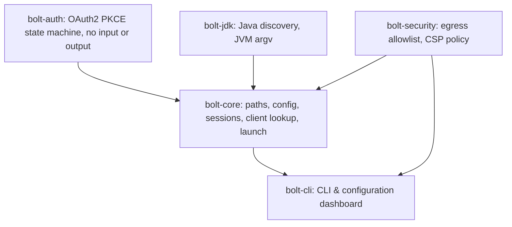

# rustyBolt

A free, portable cross-platform launcher for RuneLite and HDOS. It logs you in to your Jagex account, finds a Java runtime, and starts your client with a tuned set of JVM flags across macOS, Linux, and Windows.

rustyBolt is an alternative to the Bolt launcher. Bolt holds the login, the Java logic and the user interface in one Chromium process. rustyBolt puts the login and the Java logic in clean libraries with no heavy window toolkit dependencies, so the entire launcher is lightweight and 100% portable.

- [Install](#install)
- [Use the launcher](#use-the-launcher)
- [Troubleshooting](#troubleshooting)
- [Build from source](#build-from-source)
- [How it is made](#how-it-is-made)
- [Contributing](#contributing)
- [Disclaimer](#disclaimer)

## Install

rustyBolt starts a client that you already have. Install [RuneLite](https://oldschool.runescape.wiki/w/RuneLite) or [HDOS](https://oldschool.runescape.wiki/w/HDOS) with the installer of that project, and start it once. The launcher then finds the jar where the installer put it.

You also need a Java runtime of version 11 or newer. Version 24 or newer turns on every tuned flag. The launcher finds a runtime through `JAVA_HOME`, `PATH` and the standard locations of macOS, Linux and Windows.

Then download a rustyBolt archive from the [Releases](https://github.com/nullparity/rustyBolt/releases) page.

| system | file | steps |
| --- | --- | --- |
| macOS (Apple Silicon) | `rustybolt_<version>_darwin_arm64.tar.gz` | Extract it. Drag `rustyBolt.app` to `/Applications` or double-click to launch. |
| macOS (Intel) | `rustybolt_<version>_darwin_amd64.tar.gz` | Extract it. Drag `rustyBolt.app` to `/Applications` or double-click to launch. |
| Linux (x86_64) | `rustybolt_<version>_linux_amd64.tar.gz` | Extract it. Run `./install.sh` to add rustyBolt to your desktop menu. |
| Linux (ARM64) | `rustybolt_<version>_linux_arm64.tar.gz` | Extract it. Run `./install.sh` to add rustyBolt to your desktop menu. |
| Windows (x86_64) | `rustybolt_<version>_windows_amd64.zip` | Extract it. Double-click `rustybolt.exe` to launch. |
| Windows (ARM64) | `rustybolt_<version>_windows_arm64.zip` | Extract it. Double-click `rustybolt.exe` to launch. |

## Use the launcher

The default way to use rustyBolt is as a standalone desktop application:

- **macOS**: Open `rustyBolt.app` from `/Applications` or Spotlight.
- **Windows**: Double-click `rustybolt.exe`.
- **Linux**: Open `rustyBolt` from your application menu or run `rustybolt`.

Launching rustyBolt opens a native standalone desktop window:
- View your active **Jagex Account** and switch between accounts with 1 click.
- Select your **Character (Account)** from the visual picker.
- Choose your client: **RuneLite** or **HDOS**.
- Click **PLAY** to launch directly.
- Configure JVM tuning, memory allocation, and custom paths under **Settings**.

### Command Line

You can also run rustyBolt from a terminal:

```sh
rustybolt                    # open native desktop window
rustybolt --browser          # open launcher in your default browser
rustybolt launch runelite    # start RuneLite directly
rustybolt launch hdos        # start HDOS directly
rustybolt login              # log in to your Jagex account, once
rustybolt verify             # show what a launch does without starting anything
rustybolt configure          # open launcher explicitly
rustybolt help               # display command-line usage
```

`rustybolt login` prints a URL. Open it in a browser and log in. The browser then lands on a redirect page. Copy the whole address bar of that page and paste it at the prompt. The launcher saves the session, so subsequent launches need no login.

`rustybolt verify` checks the client jar, the session and the Java runtime, then prints the command line that `launch` runs.

## Troubleshooting

**RuneLite is not installed.** Install it from the [wiki page](https://oldschool.runescape.wiki/w/RuneLite) and start it once. The error lists every place that the launcher looked. A jar in another place: `rustybolt configure`, or `rustybolt launch runelite --jar <path>`.

**HDOS is not installed.** Install it from the [wiki page](https://oldschool.runescape.wiki/w/HDOS) and start it once.

**No Java runtime of version 11 or newer exists.** Install a runtime or configure a custom Java path in `rustybolt configure`.

**The client starts with the wrong flags.** Check the command line with `rustybolt verify` or adjust JVM settings in `rustybolt configure`. A runtime older than 24 drops the compact object headers, the string deduplication, the native access flag and the AOT cache.

**The session expired.** Run `rustybolt login` again. The launcher keeps one session per Jagex account.

## Build from source

You need a Rust toolchain of version 1.82 or newer from [rustup](https://rustup.rs).

```sh
cargo test --workspace
cargo run -p bolt-cli -- help
cargo run -p bolt-cli -- configure
```

### Make a release

A tag that starts with `v` starts the release workflow. The workflow builds
`rustybolt` on a native runner for each target. It then uploads the archives,
`checksums.txt` and publishes the release.

```sh
git tag v0.1.0
git push origin v0.1.0
```

The targets are macOS (arm64, amd64), Linux (arm64, amd64) and Windows (amd64).
Pull requests and pushes to `main` run `cargo fmt`, `cargo clippy` and
`cargo test` on the three systems.

## How it is made

### The split



| crate | owns | knows about |
| --- | --- | --- |
| `bolt-auth` | the Jagex OAuth2 PKCE flow | nothing, no input or output |
| `bolt-jdk` | Java discovery and JVM arguments | the file system only |
| `bolt-security` | egress allowlist and Content Security Policy | nothing, no input or output |
| `bolt-core` | paths, config, sessions, client lookup, launch | `bolt-auth`, `bolt-jdk`, `bolt-security`, HTTP |
| `bolt-cli` | portable CLI driver and configuration UI | `bolt-core`, `bolt-jdk`, `bolt-security` |

`CONTRACT.md` holds the public API of every crate.

#### Why the split helps a port

In Bolt, `Browser::LoginWindow` is at the same time the window, the HTTP interceptor
and the OAuth client. Java discovery and the process launch sit in two platform files
of the launcher window class. A port to a new system touches all three concerns.

In rustyBolt a new shell implements the user interface only. It gives each URL that
its browser view reaches to `LoginFlow::on_navigation`, and it runs the action that
comes back. The protocol, the Java rules and the file layout do not change.

### What works today

- Log in with your Jagex account. The launcher keeps the session, so the next start needs no login.
- Pick a character. The launcher offers the one you opened last.
- Find RuneLite or HDOS where its own installer put it. You can also name the jar.
- Find Java on its own. The launcher looks in `JAVA_HOME`, on `PATH` and in the standard places of each system. You can also name a Java binary.
- Start RuneLite with a tuned set of JVM flags. The launcher drops each flag that your Java version does not accept.
- Wi-Fi mode sends a 100ms ICMP keepalive to the default gateway to stop Wi-Fi sleep lag.
- Closing the application window hides it to the system tray so the background keepalive stays active.
- Lock down network egress to only official Jagex endpoints and localhost, preventing tracking or unauthorized connections.
- Start faster from the second run on, through a startup cache that the launcher rebuilds when the client updates.
- Show the client under its own name in the Dock and the process list, not as `java`.
- Keep RuneLite settings in a home of its own, so the launcher never touches `~/.runelite`. One command copies your existing settings in.
- Force RuneLite profile settings, for example a fixed graphics block.
- Wrap the launch in your own command, for example a wrapper script or a sandbox.
- Read login values from a secret manager, such as the 1Password command line tool.
- Write a GC log per client, and remove the log when that client ends.
- Use the native macOS application or the command line tool. Both do the same work.

Out of scope for now: the official RS3 and OSRS native clients, the plugin library and
the Lua overlay. Those parts of Bolt do not touch the three seams that this project
divides.

### The tuned launch profile

The default RuneLite profile comes from `rl-launcher`. `rustybolt verify`
shows the exact command line that a launch runs.

| setting | value | note |
| --- | --- | --- |
| heap | `-Xms2g -Xmx2g` | a fixed heap, so the collector never grows it |
| collector | `-XX:+UseZGC` | `-XX:+ZGenerational` below feature 24 only |
| stack | `-Xss2m` | |
| feature 24 and newer | compact object headers, string deduplication, native access | older JDKs reject them |
| AOT cache | `-XX:AOTCacheOutput=` then `-XX:AOTCache=` | the first run writes it, later runs read it |
| open packages | seven `--add-opens` values | the client needs them for reflection |
| macOS | Metal java2d, the system appearance, the Dock name and icon | |
| client | `--hw-accel METAL --launch-mode REFLECT` | `REFLECT` keeps the client in this JVM |

`--launch-mode REFLECT` matters. In the fork mode the RuneLite launcher starts a second
JVM with its own `-Xmx768m` and drops every flag above.

`bolt_jdk::Tuning::flags(feature)` is pure. The caller gives the feature number, so a
machine with one JDK can still test every gate. `bolt_core::plan` builds the command
that `bolt_core::launch` runs, so a dry run and a real launch never differ.

### Faults of Bolt that this project corrects

| Bolt | rustyBolt |
| --- | --- |
| `std::rand` makes the state and the verifier | the operating system generator makes them |
| the `id_token` goes to standard output | no token is printed |
| the credential file keeps the default mode | the session file uses mode 0600 |
| the launcher downloads the client itself | the launcher starts the client that the user installed |
| Java discovery reads `JAVA_HOME` and `PATH` | discovery also reads the standard locations |

### Storage

| system | config and data | cache and runtime |
| --- | --- | --- |
| Linux | `$XDG_CONFIG_HOME/rustybolt`, `$XDG_DATA_HOME/rustybolt` | `$XDG_CACHE_HOME/rustybolt`, `$XDG_RUNTIME_DIR/rustybolt` |
| macOS | `~/Library/Application Support/rustybolt` | `~/Library/Caches/rustybolt` |
| Windows | `%APPDATA%\rustybolt` | `%LOCALAPPDATA%\rustybolt` |
## Contributing

Run `cargo fmt --all`, `cargo clippy --workspace --all-targets -- -D warnings` and `cargo test --workspace` before you push. Continuous integration runs the same three commands on macOS, Linux and Windows.

Write comments and commit messages that state the code, not the edit.

Do not add an attribution line for an AI tool to a commit or a pull request. `AI-USAGE.md` states where this project uses AI.

## Disclaimer

rustyBolt is an unofficial project. It is not affiliated with Jagex, RuneLite or HDOS. Those parties are not responsible for any problem with rustyBolt or any damage that rustyBolt causes.

rustyBolt is not a game client. It runs the unmodified clients that the user installed. It cannot modify or automate gameplay. The launcher uses only the public login endpoints, and it never reads or alters game data.

RuneScape, Old School RuneScape and Jagex are trademarks of Jagex Limited.
