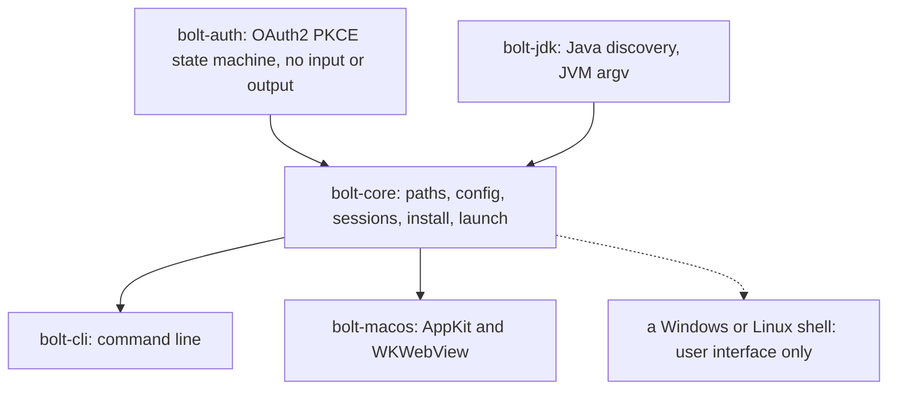

# rustyBolt

A free launcher for RuneLite and HDOS. It logs you in to your Jagex account, picks a Java runtime, downloads the client and starts it with a tuned set of JVM flags. macOS gets a native application. Every system gets a command line tool.

rustyBolt is an alternative to the Bolt launcher. Bolt holds the login, the Java logic and the user interface in one Chromium process. rustyBolt puts the login and the Java logic in libraries with no user interface, so a shell for a new system is small. The technical half of this file explains that split.

- [Install](#install)
- [Use the launcher](#use-the-launcher)
- [Troubleshooting](#troubleshooting)
- [Build from source](#build-from-source)
- [How it is made](#how-it-is-made)
- [Contributing](#contributing)
- [Disclaimer](#disclaimer)

## Install

You need a Java runtime of version 11 or newer. Version 24 or newer turns on every tuned flag. [Adoptium](https://adoptium.net) gives a free build for each system. The launcher finds a runtime through `JAVA_HOME`, `PATH` and the standard locations of macOS, Linux and Windows.

Download an archive from the [Releases](https://github.com/nullparity/rustyBolt/releases) page.

| system | file | steps |
| --- | --- | --- |
| macOS application | `rustyBolt_<version>_darwin_arm64.app.zip` | Unzip it. Move `rustyBolt.app` to Applications. |
| macOS command line | `rustybolt_<version>_darwin_<arch>.tar.gz` | Extract it. Put `rustybolt` on your `PATH`. |
| Linux | `rustybolt_<version>_linux_<arch>.tar.gz` | Extract it. Put `rustybolt` on your `PATH`. |
| Windows | `rustybolt_<version>_windows_amd64.zip` | Extract it. Put `rustybolt.exe` on your `PATH`. |

The macOS application has no Apple developer signature. If macOS refuses to open it, open System Settings, then Privacy & Security, then click Open Anyway. The command below does the same thing:

```sh
xattr -d com.apple.quarantine /Applications/rustyBolt.app
```

## Use the launcher

The macOS application shows a login page. After the login it lists your characters. Pick one and click Launch. The Advanced window shows the Java runtime, the tuned flags and the exact command line.

The command line tool does the same work in four commands:

```sh
rustybolt login              # prints a login URL, then asks for the redirect address
rustybolt accounts           # lists the characters of the saved session
rustybolt install runelite   # downloads the newest client
rustybolt launch runelite    # starts the client and returns
```

`rustybolt login` prints a URL. Open it in a browser and log in. The browser then lands on a redirect page. Copy the whole address bar of that page and paste it at the prompt. The launcher saves the session, so the next launch needs no login.

`rustybolt launch runelite --dry-run` prints the command line and starts nothing. `rustybolt tuning` shows the tuned profile and `rustybolt tuning set <key> <value>` changes one setting. `rustybolt help` lists every command.

The launcher gives RuneLite its own home directory, so it never writes into `~/.runelite`. `rustybolt import` copies your existing RuneLite settings into that home. `rustybolt home use system` makes the launcher use `~/.runelite` instead.

## Troubleshooting

**No Java runtime of version 11 or newer exists.** Install a runtime, or point the launcher at one: `rustybolt java use /path/to/bin/java`. `rustybolt java list` shows every runtime that the launcher can see.

**The client starts with the wrong flags.** Run `rustybolt tuning flags`. It names each option that the Java feature gate removed. A runtime older than 24 drops the compact object headers, the string deduplication, the native access flag and the AOT cache.

**The session expired.** Run `rustybolt login` again. The launcher keeps one session per Jagex account. `rustybolt sessions` lists them and `--sub` picks one at launch.

**Where are my files?** `rustybolt paths` prints the four directories. The [Storage](#storage) table gives the defaults.

## Build from source

You need a Rust toolchain of version 1.82 or newer from [rustup](https://rustup.rs). The macOS application needs Xcode command line tools. To build the application bundle, run `icon/build.sh` once (it needs `brew install librsvg`), then `macos/build-app.sh`. The bundle lands in `target/rustyBolt.app`.

```sh
cargo test --workspace
cargo run -p bolt-cli -- help
cargo run -p bolt-macos
```

The macOS application has a self check that prints the window state. Use it on a
machine with no screen access:

```sh
cargo run -p bolt-macos -- --self-check --self-check-login
```

### Make a release

A tag that starts with `v` starts the release workflow. The workflow builds
`rustybolt` on a native runner for each target and makes `rustyBolt.app` on
macOS. It then uploads the archives, `checksums.txt` and a draft release.

```sh
git tag v0.1.0
git push origin v0.1.0
```

The targets are macOS (arm64, amd64), Linux (arm64, amd64) and Windows (amd64).
Pull requests and pushes to `main` run `cargo fmt`, `cargo clippy` and
`cargo test` on the three systems.

### Every command

```sh
rustybolt java list                 # every Java runtime of this machine
rustybolt java select --min 21      # the runtime that the launcher would use
rustybolt paths                     # the four platform directories
rustybolt login                     # drives the flow with pasted redirect addresses
rustybolt sessions                  # the saved sessions
rustybolt accounts                  # the characters of a session
rustybolt install runelite          # downloads the newest client
rustybolt launch runelite --dry-run # prints the command line and starts nothing
```

## How it is made

### The split



| crate | owns | knows about |
| --- | --- | --- |
| `bolt-auth` | the Jagex OAuth2 PKCE flow | nothing, no input or output |
| `bolt-jdk` | Java discovery and JVM arguments | the file system only |
| `bolt-core` | paths, config, sessions, install, launch | `bolt-auth`, `bolt-jdk`, HTTP |
| `bolt-cli` | a headless driver | `bolt-core` |
| `bolt-macos` | the native macOS application | `bolt-core` |

`CONTRACT.md` holds the public API of every crate.

#### Why the split helps a port

In Bolt, `Browser::LoginWindow` is at the same time the window, the HTTP interceptor
and the OAuth client. Java discovery and the process launch sit in two platform files
of the launcher window class. A port to a new system touches all three concerns.

In rustyBolt a new shell implements the user interface only. It gives each URL that
its browser view reaches to `LoginFlow::on_navigation`, and it runs the action that
comes back. The protocol, the Java rules and the file layout do not change.

### What works today

- The complete Jagex login: authorization, token exchange, consent, game session.
- The character list of a session.
- Java discovery through `JAVA_HOME`, `PATH` and the standard locations of macOS,
  Linux and Windows.
- RuneLite and HDOS install with progress, and a digest check when the release gives
  one.
- A detached client process with the `JX_SESSION_ID`, `JX_CHARACTER_ID` and
  `JX_DISPLAY_NAME` values.
- A user launch template with the `%command%` token.
- A command line shell and a native macOS application.
- A tuned RuneLite launch profile, with the flags gated by the Java feature number.
- An AOT startup cache that is keyed to the client jar, and a stale cache clean up.
- Optional GC logging, with a clean up of the log of each dead client.
- A process name for the client, made with a hard link to the Java binary.
- An account picker that offers the character that the user opened last.
- Login values from a secret manager, such as the 1Password command line tool.
- Forced RuneLite profile properties, for example a fixed graphics block.

Out of scope for now: the official RS3 and OSRS native clients, the plugin library and
the Lua overlay. Those parts of Bolt do not touch the three seams that this project
divides.

### The tuned launch profile

The default RuneLite profile comes from `rl-launcher`. `rustybolt tuning` prints it and
`rustybolt launch runelite --dry-run` shows the exact command line that a launch runs.

| setting | value | note |
| --- | --- | --- |
| heap | `-Xms2g -Xmx2g` | a fixed heap, so the collector never grows it |
| collector | `-XX:+UseZGC` | `-XX:+ZGenerational` below feature 24 only |
| stack | `-Xss2m` | |
| feature 24 and newer | compact object headers, string deduplication, native access | older JDKs reject them |
| AOT cache | `-XX:AOTCacheOutput=` then `-XX:AOTCache=` | the first run writes it, later runs read it |
| open packages | seven `--add-opens` values | the client needs them for reflection |
| macOS | Metal java2d, the system appearance, the Dock name and icon | |
| client | `--hw-accel METAL --launch-mode REFLECT` | `REFLECT` keeps the client in this JVM |

`--launch-mode REFLECT` matters. In the fork mode the RuneLite launcher starts a second
JVM with its own `-Xmx768m` and drops every flag above.

`bolt_jdk::Tuning::flags(feature)` is pure. The caller gives the feature number, so a
machine with one JDK can still test every gate. `bolt_core::plan` builds the command
that `bolt_core::launch` runs, so a dry run and a real launch never differ.

### Faults of Bolt that this project corrects

| Bolt | rustyBolt |
| --- | --- |
| `std::rand` makes the state and the verifier | the operating system generator makes them |
| the `id_token` goes to standard output | no token is printed |
| the credential file keeps the default mode | the session file uses mode 0600 |
| a download overwrites the live file | a download writes a temporary file, then renames it |
| no digest check on any download | the digest is checked when the release gives one |
| Java discovery reads `JAVA_HOME` and `PATH` | discovery also reads the standard locations |

### Storage

| system | config and data | cache and runtime |
| --- | --- | --- |
| Linux | `$XDG_CONFIG_HOME/rustybolt`, `$XDG_DATA_HOME/rustybolt` | `$XDG_CACHE_HOME/rustybolt`, `$XDG_RUNTIME_DIR/rustybolt` |
| macOS | `~/Library/Application Support/rustybolt` | `~/Library/Caches/rustybolt` |
| Windows | `%APPDATA%\rustybolt` | `%LOCALAPPDATA%\rustybolt` |

### Add a shell for another system

1. Make a crate that depends on `bolt-core`.
2. Show the sessions from `SessionStore`.
3. Open a browser view at `LoginFlow::authorize_url()`.
4. Give every URL to `LoginFlow::on_navigation`, and run the action through
   `HttpAuth::advance`. Stop the navigation when the action is not `Action::Ignore`.
5. Call `Installer` and `bolt_core::launch` from a worker thread.

Do not repeat protocol logic, Java rules or path rules in the shell.

## Contributing

Run `cargo fmt --all`, `cargo clippy --workspace --all-targets -- -D warnings` and `cargo test --workspace` before you push. Continuous integration runs the same three commands on macOS, Linux and Windows.

Write comments and commit messages that state the code, not the edit.

Do not add an attribution line for an AI tool to a commit or a pull request. `AI-USAGE.md` states where this project uses AI.

## Disclaimer

rustyBolt is an unofficial project. It is not affiliated with Jagex, RuneLite or HDOS. Those parties are not responsible for any problem with rustyBolt or any damage that rustyBolt causes.

rustyBolt is not a game client. It downloads and runs the unmodified clients. It cannot modify or automate gameplay. The launcher uses only the public login endpoints, and it never reads or alters game data.

RuneScape, Old School RuneScape and Jagex are trademarks of Jagex Limited.
