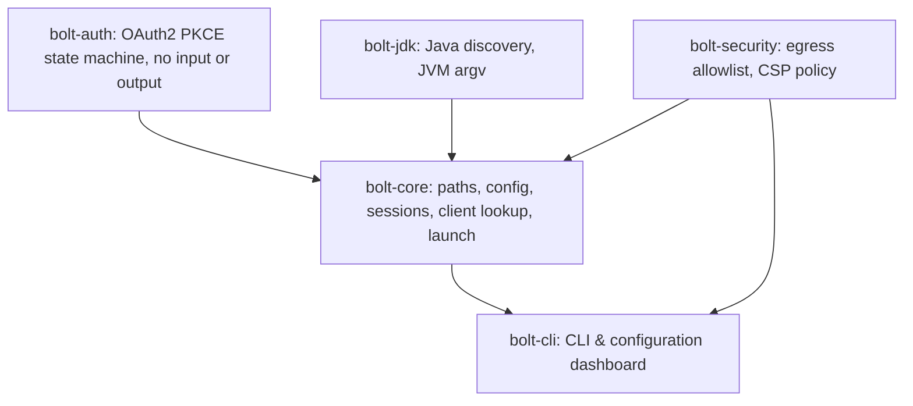

# Architecture

## The split

| crate | owns | knows about |
| --- | --- | --- |
| `bolt-auth` | the Jagex OAuth2 PKCE flow | nothing, no input or output |
| `bolt-jdk` | Java discovery and JVM arguments | the file system only |
| `bolt-security` | egress allowlist and Content Security Policy | nothing, no input or output |
| `bolt-core` | paths, config, sessions, client lookup, launch | `bolt-auth`, `bolt-jdk`, `bolt-security`, HTTP |
| `bolt-cli` | portable CLI driver and configuration UI | `bolt-core`, `bolt-jdk`, `bolt-security` |

`CONTRACT.md` holds the public API of every crate.

### Why the split helps a port

In Bolt, `Browser::LoginWindow` is at the same time the window, the HTTP interceptor and the OAuth client. Java discovery and the process launch sit in two platform files of the launcher window class. A port to a new system touches all three concerns.

In rustyBolt a new shell implements the user interface only. It gives each URL that its browser view reaches to `LoginFlow::on_navigation`, and it runs the action that comes back. The protocol, the Java rules and the file layout do not change.

## What works today

- Log in with your Jagex account. The launcher keeps the session in the system keychain, so the next start needs no login.
- Pick a character. The launcher offers the one you opened last.
- Find RuneLite or HDOS where its own installer put it. You can also name the jar.
- Find Java on its own. The launcher looks in `JAVA_HOME`, on `PATH` and in the standard places of each system. You can also name a Java binary.
- Start RuneLite with a tuned set of JVM flags. The launcher drops each flag that your Java version does not accept.
- Wi-Fi mode sends a UDP keepalive to the default gateway every 10ms to stop Wi-Fi sleep lag, and pings it every 5s for the latency readout.
- Closing the application window hides it to the system tray so the background keepalive stays active.
- Lock down network egress to only official Jagex endpoints and localhost.
- Start faster from the second run on, through a startup cache that the launcher rebuilds when the client updates.
- Show the client under its own name in the Dock and the process list, not as `java`.
- Keep RuneLite settings in a home of its own, so the launcher never touches `~/.runelite`. One command copies your existing settings in.
- Force RuneLite profile settings, for example a fixed graphics block.
- Wrap the launch in your own command, for example a wrapper script or a sandbox.
- Read login values from a secret manager, such as the 1Password command line tool.
- Write a GC log per client, and remove the log when that client ends.
- Use the native desktop application or the command line tool. Both do the same work.

Out of scope for now: the official RS3 and OSRS native clients, the plugin library and the Lua overlay. Those parts of Bolt do not touch the three seams that this project divides.

## The tuned launch profile

The default RuneLite profile comes from `rl-launcher`. `rustybolt verify` shows the exact command line that a launch runs.

| setting | value | note |
| --- | --- | --- |
| heap | `-Xms2g -Xmx2g` | a fixed heap, so the collector never grows it |
| collector | `-XX:+UseZGC` | `-XX:+ZGenerational` below feature 24 only |
| stack | `-Xss2m` | |
| feature 24 and newer | compact object headers, string deduplication, native access | older JDKs reject them |
| AOT cache | `-XX:AOTCacheOutput=` then `-XX:AOTCache=` | the first run writes it, later runs read it |
| open packages | seven `--add-opens` values | the client needs them for reflection |
| macOS | Metal java2d, the system appearance, the Dock name and icon | |
| client | `--hw-accel METAL --launch-mode REFLECT` | `REFLECT` keeps the client in this JVM |

`--launch-mode REFLECT` matters. In the fork mode the RuneLite launcher starts a second JVM with its own `-Xmx768m` and drops every flag above.

`bolt_jdk::Tuning::flags(feature)` is pure. The caller gives the feature number, so a machine with one JDK can still test every gate. `bolt_core::plan` builds the command that `bolt_core::launch` runs, so a dry run and a real launch never differ.

## Faults of Bolt that this project corrects

| Bolt | rustyBolt |
| --- | --- |
| `std::rand` makes the state and the verifier | the operating system generator makes them |
| the `id_token` goes to standard output | no token is printed |
| the credential file keeps the default mode | the session lives in the system keychain |
| the launcher downloads the client itself | the launcher starts the client that the user installed |
| Java discovery reads `JAVA_HOME` and `PATH` | discovery also reads the standard locations |
